# Geolocation Attendance Control

[](LICENSE)

**Translations**: [Español](.github/lang/es-ES/README.md)

WordPress plugin for attendance control of extracurricular activities monitors.

---

- [Requirements](#requirements)
- [Installation](#installation)
- [Features](#features)
- [Images](#images)
- [Sponsor](#Sponsor)
- [License](#license)

---

**If you make use of this project**, be aware that the geolocation is easily manipulated by the user.
At the time no feature was developed to prevent this as it was not necessary for the purpose of the project.

## Requirements

It was developed under WordPress 5 and PHP 7.

## Installation

For testing purposes, you can clone the entire repository in the WordPress plugins directory:

```console
git clone https://github.com/josantonius/wp-geolocation-attendance-control.git
```

And then add the `google_api_key` in the `config/setting.php` file.

## Features

- Educational center management.
- Educational instructor management.
- Extracurricular activities management.
- Geolocation attendance control.
- Generation of reports by date.
- Attendance Records Management.
- Inputs and outputs control.
- Time and location control.

## Images

### Educational Center Management

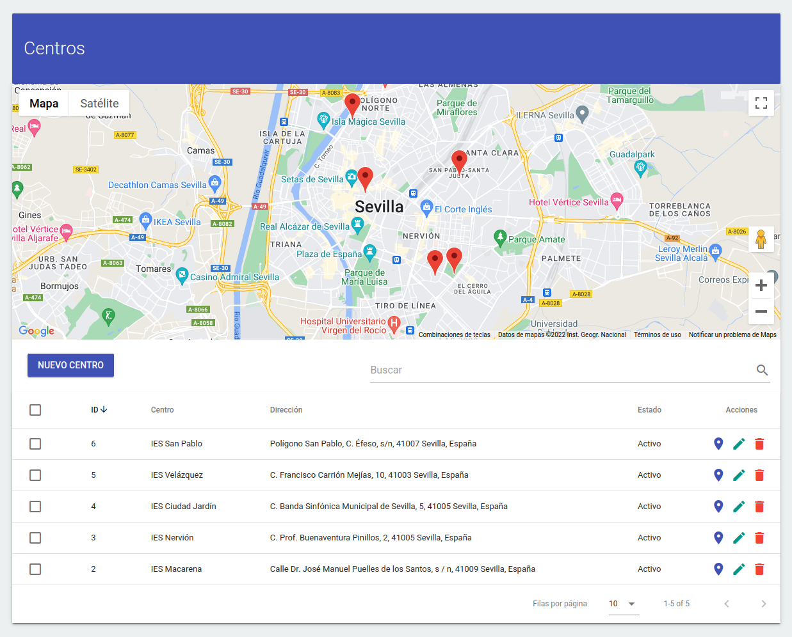
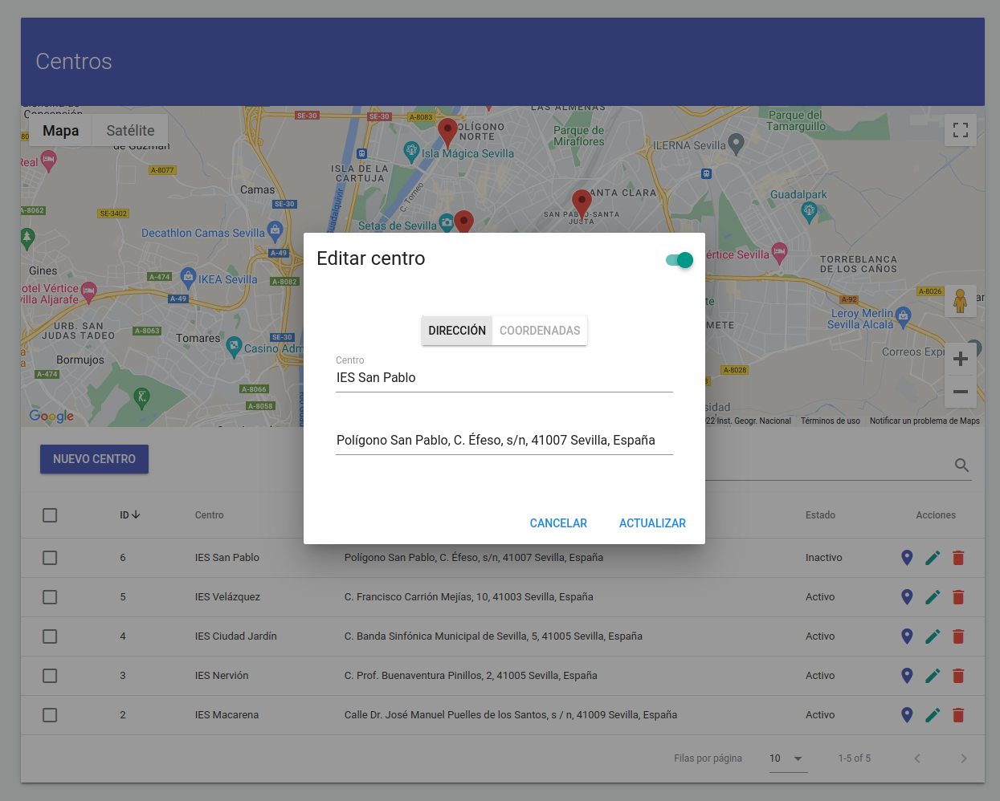
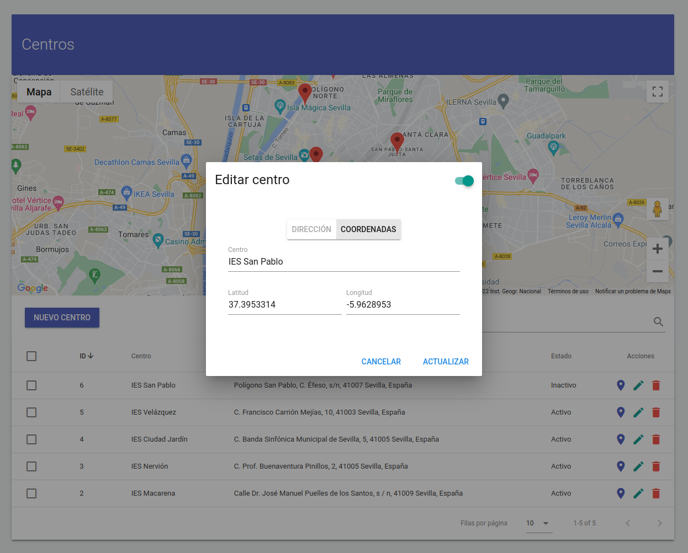
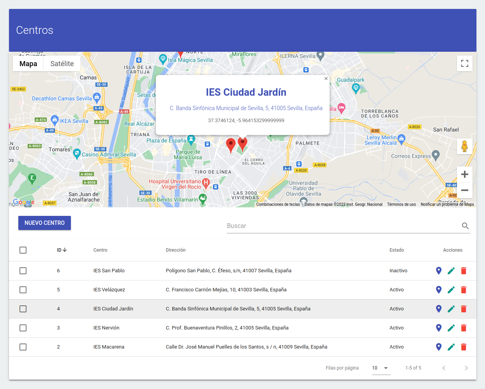

### Extracurricular Activities Management

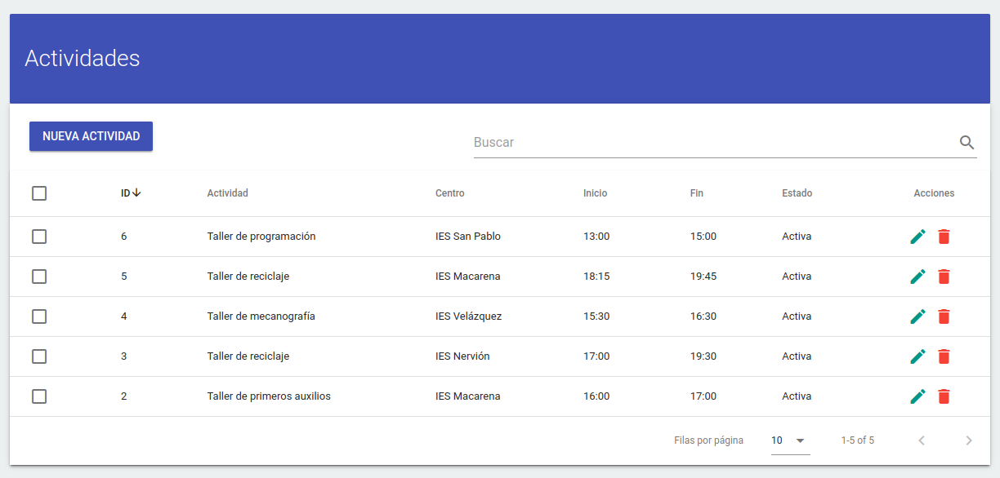
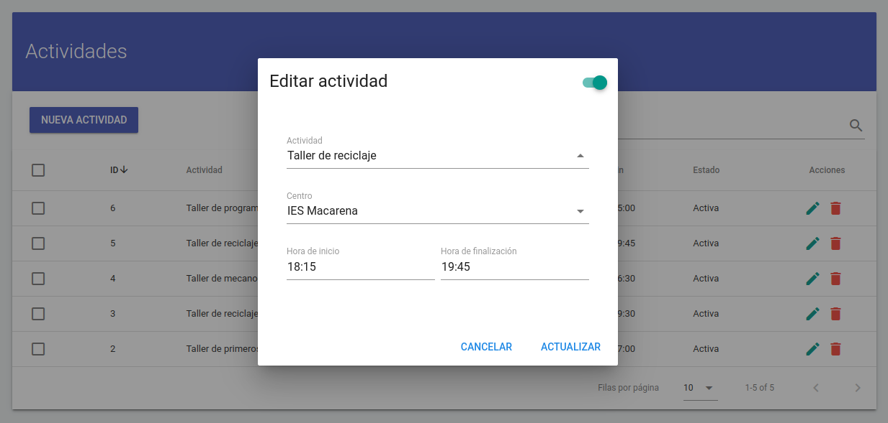

### Attendance Records

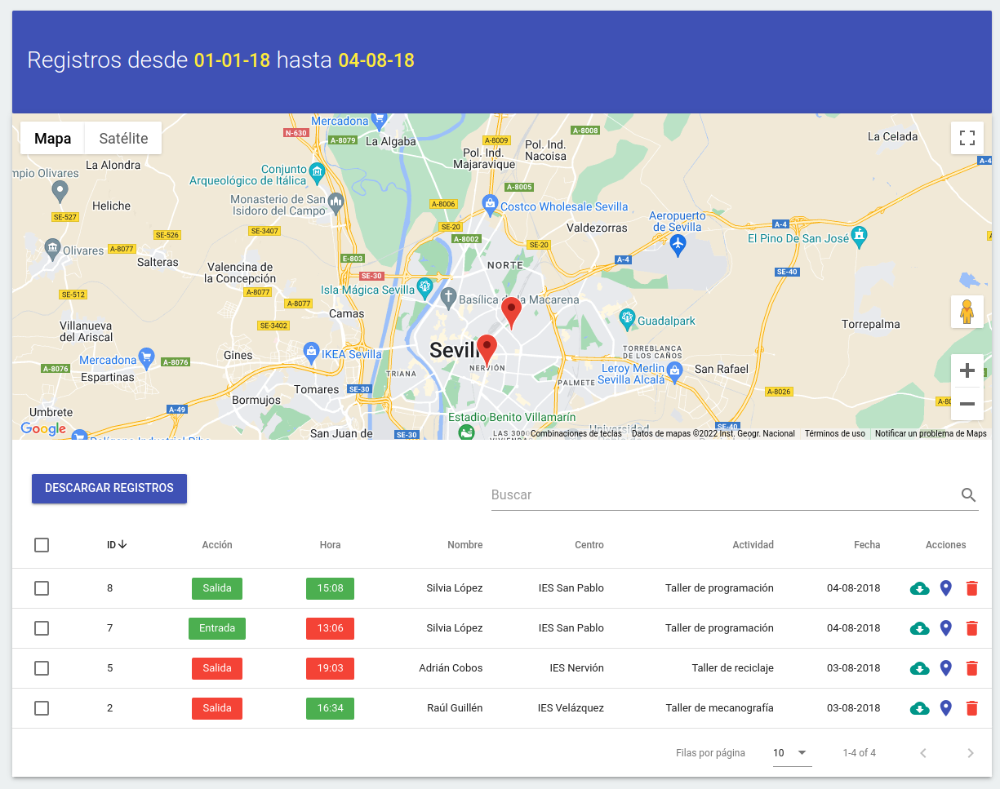
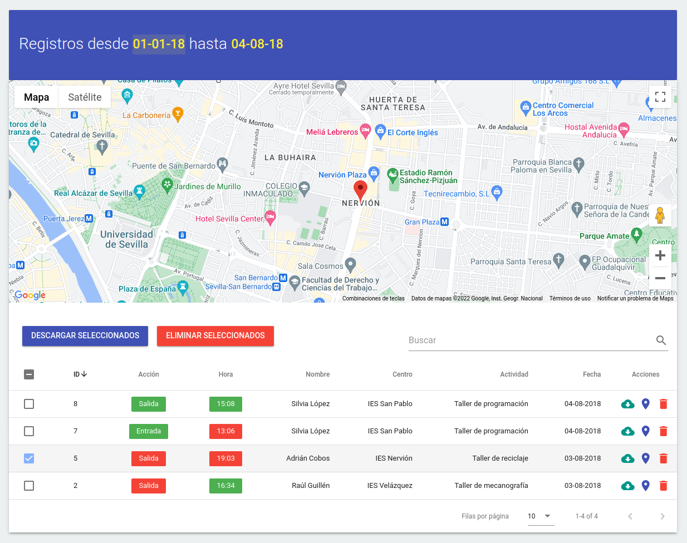
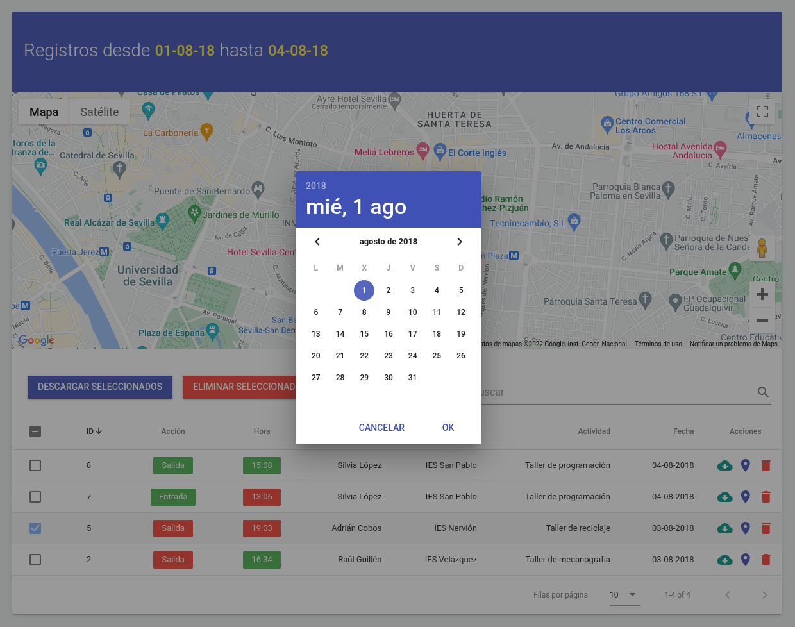
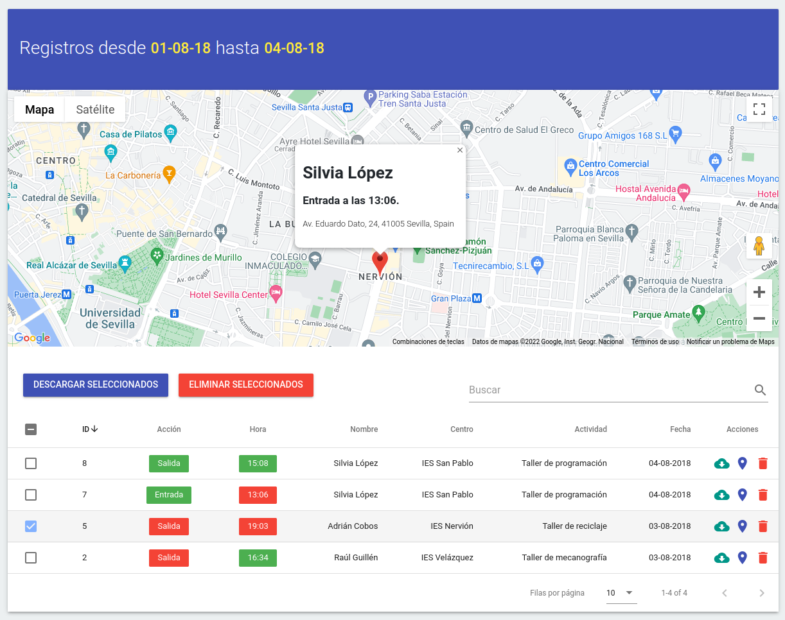
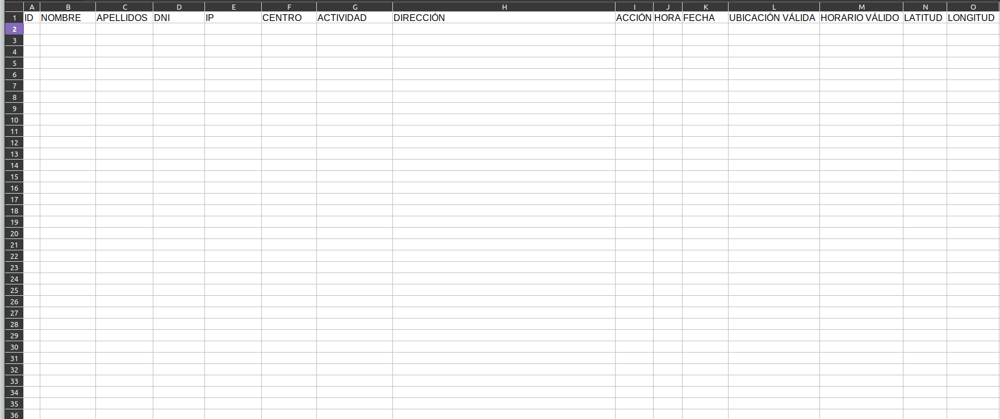

### Attendance Control

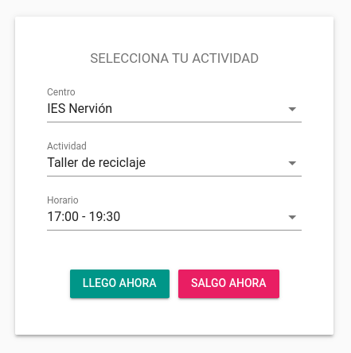

### Post-Check Notices

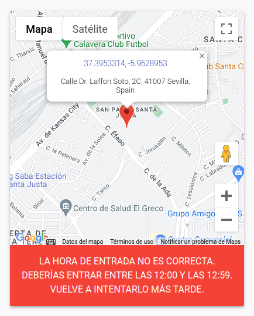
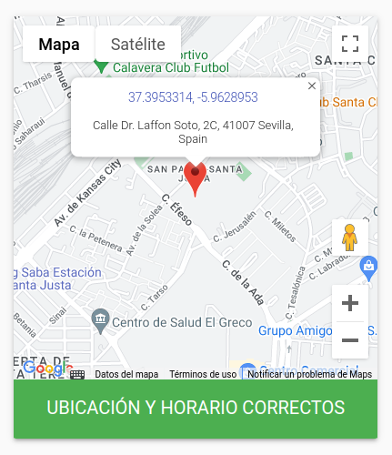
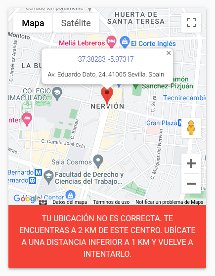

## Sponsor

If this project helps you to reduce your development time,
[you can sponsor me](https://github.com/josantonius#sponsor) to support my open source work :blush:

## License

This repository is licensed under the [MIT License](LICENSE).

Copyright © 2018-2022, [Josantonius](https://github.com/josantonius#contact)
